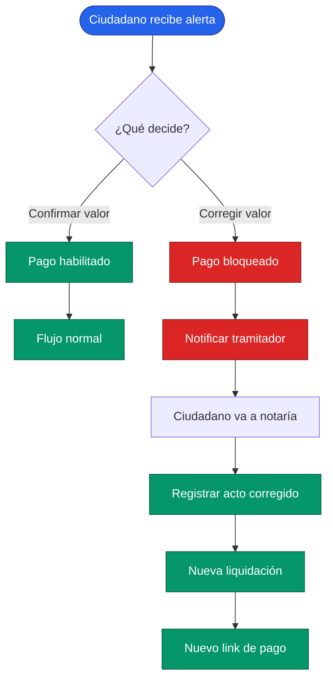

```mermaid
flowchart TD

    A([Ciudadano recibe alerta])

    A --> B{¿Qué decide?}

    B -->|Confirmar valor| C[Pago habilitado]
    C --> D[Flujo normal]

    B -->|Corregir valor| E[Pago bloqueado]
    E --> F[Notificar tramitador]
    F --> G[Ciudadano va a notaría]
    G --> H[Registrar acto corregido]
    H --> I[Nueva liquidación]
    I --> J[Nuevo link de pago]

    classDef ciudadano fill:#2563eb,color:#fff,stroke:#1e40af;
    classDef sistema fill:#059669,color:#fff,stroke:#065f46;
    classDef alerta fill:#dc2626,color:#fff,stroke:#7f1d1d;

    class A ciudadano;
    class C,D,H,I,J sistema;
    class E,F alerta;
```