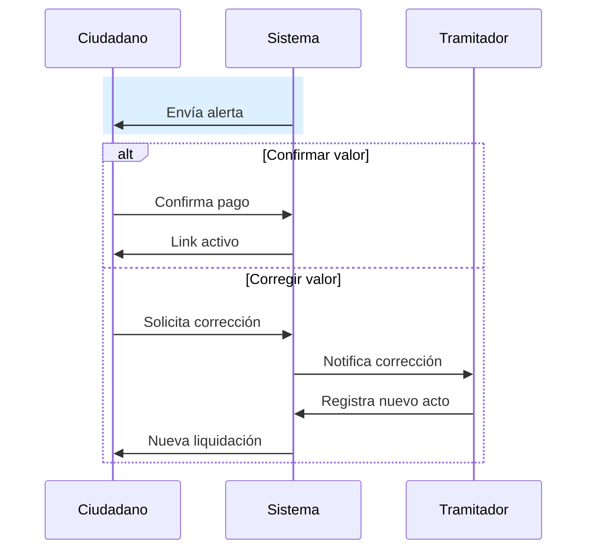

```mermaid
sequenceDiagram
    participant C as Ciudadano
    participant S as Sistema
    participant T as Tramitador

    rect rgb(220, 240, 255)
        S->>C: Envía alerta
    end

    alt Confirmar valor
        C->>S: Confirma pago
        S->>C: Link activo
    else Corregir valor
        C->>S: Solicita corrección
        S->>T: Notifica corrección
        T->>S: Registra nuevo acto
        S->>C: Nueva liquidación
    end
```