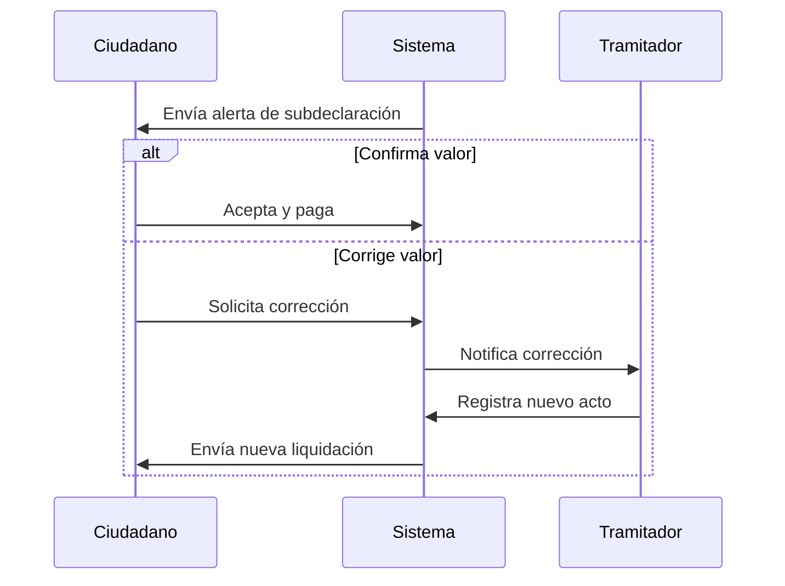

```mermaid
sequenceDiagram
    participant C as Ciudadano
    participant S as Sistema
    participant T as Tramitador

    S->>C: Envía alerta de subdeclaración

    alt Confirma valor
        C->>S: Acepta y paga
    else Corrige valor
        C->>S: Solicita corrección
        S->>T: Notifica corrección
        T->>S: Registra nuevo acto
        S->>C: Envía nueva liquidación
    end
```